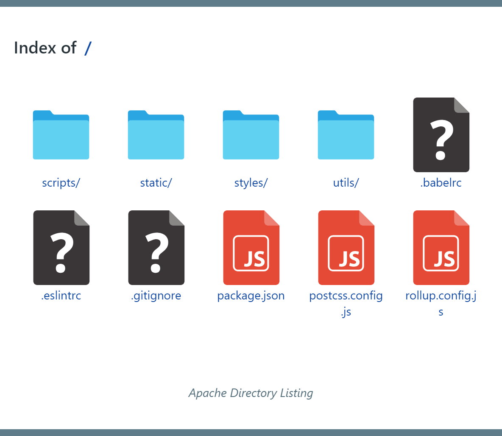
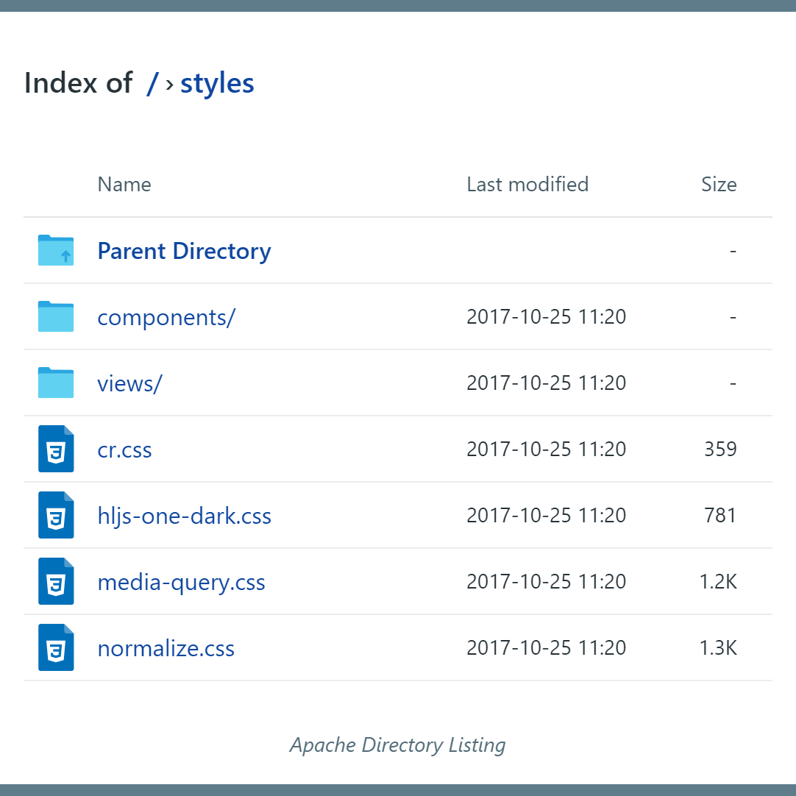

# Apache-Directory-Listing

> A directory listing theme for Apache

'Apache Directory Listing' is a directory listing theme inspired from [Apaxy](https://github.com/AdamWhitcroft/Apaxy) which uses Apache's `mod_autoindex` module.

## Themes

|        Grid style       |        Table style        |
|:-----------------------:|:-------------------------:|
|  |  |

## Usage

1. Download or clone the repo and copy `directory-listing` directory to the root directory of Apache.
1. Copy `htaccess.txt` file to the root directory of your server, rename it to `.htaccess`.
1. Inside the renamed `.htaccess` file
   - Replace `{LISTING_DIRECTORY}` to the location of `directory-listing` folder on your server.
   - Replace `{LISTING_STYLE}` to either `grid` or `table`.

## Credits
* Icons referenced from [File Types Icons Set](https://web.archive.org/web/20161030160003/http://uifest.com/product/file-types-icons-set).

## License
[MIT](license.txt)
